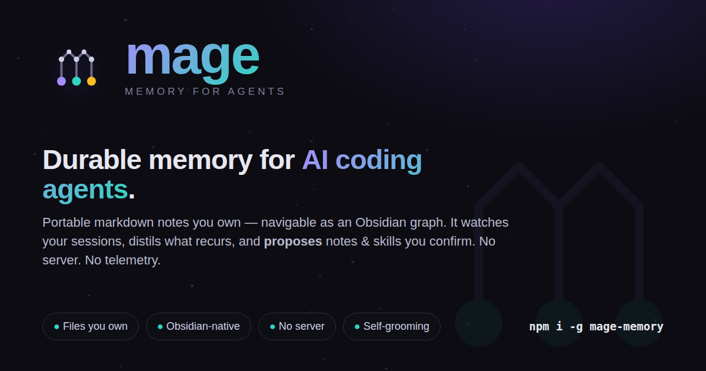

<p align="center">
  
</p>

# mage

> **Durable memory for AI coding agents — portable markdown notes you own,
> navigable as an Obsidian graph.**

> **M**emory for **AGE**nts. A portable, file-based, self-maintaining knowledge
> base for software systems: durable git-backed markdown **notes** that capture
> insight, procedure, and **pointers** to sources — never copies of sources —
> navigable as an Obsidian graph and usable by any AI coding agent.

[](https://github.com/Sumit1993/mage-memory/actions/workflows/ci.yml)
[](https://www.npmjs.com/package/mage-memory)


<p align="center">
  
</p>

## Why mage

- **Files you own.** Every note is plain markdown in *your* git repo. No
  database, no lock-in, no export step — `cat`, `grep`, and `git log` all work.
- **Obsidian-native.** `mage/` ships an `.obsidian/` vault config; cross-links
  are relative markdown (`[text](path.md)`, never `[[wikilinks]]`), so notes
  render as a navigable graph **and** stay portable to any agent reading raw
  files.
- **No server.** Nothing to host, no daemon, no background process. mage rides
  the host agent's hooks; the dashboard is a generated artifact, not a service
  ([ADR-0020](mage/decisions/0020-no-server-tiered-dashboards.md)).
- **No telemetry — nothing leaves your machine.** mage never phones home. The
  only network egress is `doctor`'s opt-in connectivity check; metrics stay
  local and never enter git
  ([ADR-0021](mage/decisions/0021-offline-no-telemetry-local-signal.md)).
- **Self-grooming, human-in-the-loop.** mage *proposes* (graduate / merge /
  reword …); **you** confirm and commit. Nothing is ever auto-committed.

### How mage differs from a server-backed memory store

mage was designed by mining the *idea* behind server-backed agent-memory tools
(durable memory that outlives a session) — not their mechanism. The contrast is
deliberate and factual:

| | mage | server-backed memory store |
|--|------|----------------------------|
| Source of truth | **Files in your repo** (markdown + git) | A running server / database |
| Curation | **Human-in-the-loop**: propose → confirm → *you* commit | Automatic writes / decay |
| Network | **Offline by default**; no telemetry | Typically server-hosted |
| Viewer | Generated `dashboard.html` + Obsidian | Live web console |

Same goal — memory that survives the session — reached by *file-as-truth +
offline + human-curated* rather than an automatic, server-shaped store.

## What it does

The hard-won knowledge about a software system — what an interface expects, why
a decision was made, how two services connect, the exact way to call them, the
gotcha that wasted an afternoon — never lives in one place. It scatters across
in-repo `docs/`, out-of-repo wikis, ticket comments, and an agent's transient
chat history, then gets cleaned up, rewritten, or simply lost the moment the
task is done. mage gives that knowledge one **durable, portable, discoverable
home**. Each note records the reusable **insight** (verbatim — don't
oversimplify), the **procedure** (how to do it faster next time; which commands
to avoid and why), and **pointers** to where the canonical source lives and when
to go read it. The goal is to *do it faster and make fewer mistakes next time* —
not to archive what you already read.

## Install

```bash
# Install the CLI globally — exposes the `mage` command
npm i -g mage-memory
```

mage's skills ship as a **Claude Code plugin** so they group under a clean
`mage:` namespace. Install the whole group:

```text
/plugin marketplace add Sumit1993/mage-memory
/plugin install mage@mage
```

You get `mage:learn` (capture a note) and `mage:guide` (how to use the base). The
**self-grooming loop** adds `mage:groom` (mine observed scratch — first-sight
insight + recurrence catch-net), `mage:graduate` (proven note → skill), and
`mage:optimize` (reword/demote a mis-firing trigger). `mage init` prints the two
install lines for you (it never runs slash commands). Per-wing `mage-wing-*`
skills are still **generated** into `.claude/skills/` + `.agents/skills/` by
`mage skills`. Backfill existing docs/skills with `mage:learn --from <dir>`.

> The `mage:` namespace is a Claude Code feature. Other agents that read
> `.agents/skills/` directly will see bare skill names.

## Quickstart

```bash
# 1. Initialize a knowledge base inside the current repo
mage init --in-repo

# 2. Add a note under mage/notes/ tagged #wing/room (see example below)

# 3. Regenerate the always-loaded index
mage index

# 4. (Re)generate the per-wing skills so agents discover this knowledge base
mage skills
```

A tiny note — `mage/notes/billing/payments.md`:

```markdown
---
type: interface
tags: [billing/payments]
created: 2026-06-01
updated: 2026-06-01
sources:
  - https://github.com/acme/billing/blob/main/src/charge.ts#L40
  - file:src/charge.ts:40
status: active
---

# Charging a customer

## Insight
`charge()` is idempotent **only** when you pass an `idempotency_key`. Without
it, a retried request double-charges. The key must be unique per logical charge,
not per HTTP attempt.

## Procedure
- Generate the key once, upstream, and thread it through retries.
- Do NOT regenerate the key inside the retry loop — that defeats idempotency.

## Relations
- depends_on [payments-gateway](../infra/payments-gateway.md)
```

Everything in the frontmatter is optional; mage degrades gracefully when it's
missing and falls back to the title, headers, and tags. Links between notes are
standard portable markdown — `[text](relative/path.md)` — **never**
`[[wikilinks]]`, so they render as Obsidian graph edges and stay portable across
agents.

## The model

| Term | Meaning |
|------|---------|
| **knowledge base** | The mage knowledge base: notes, work units, decisions, archive, and the generated index. One KB per repo (in-repo or hybrid) or one hub-KB spanning many repos. |
| **note** | A durable markdown file (with optional YAML frontmatter) recording insight + procedure + pointers on one topic. |
| **wing** | A top-level scope — a project, repo, service, or person. The first tag segment (`billing/payments` → wing `billing`). **Optional**: untagged notes are valid (they index as *Cross-cutting*). A note can carry several tags and is indexed under **each** wing (multi-home); the first is its primary wing. |
| **room** | A topic within a wing. The second tag segment (`billing/payments` → room `payments`). |
| **index** | The generated, always-loaded map of the knowledge base (`mage/INDEX.md`). Run `mage index`; never hand-edit. |
| **work unit** | A task-scoped "lab notebook" under `mage/work/<slug>/` with a `type` (spec, investigation, incident, spike, ...). |
| **artifact** | Scratch output inside a work unit's `artifacts/` subdir. Git-ignored — never committed. |
| **skill** | An auto-discovered agent capability (a folder with `SKILL.md`) that teaches agents how to use this knowledge base. |

## Layout (in-repo KB)

```text
mage/
├── notes/              durable topic notes (the "encyclopedia")
├── work/<slug>/        task-scoped "lab notebook" work units
│   └── artifacts/      scratch output (git-ignored)
├── decisions/          ADR-style decision notes
├── archive/            retired notes
├── INDEX.md            GENERATED always-loaded index (run `mage index`)
├── _index.<wing>.md    GENERATED per-wing index (hierarchical mode) — reserved name
├── .mage/              GENERATED machine state (git-ignored): learnings/ metrics/ staging/ (ADR-0025)
├── .obsidian/          Obsidian vault config
└── metadata.json       schema "mage.v2"; mode "in-repo" | "hybrid" | "external"
```

The scanner recurses the **whole** KB and indexes every note except a fixed
skip-set (`.obsidian/`, `.git/`, `node_modules/`, `artifacts/`, `.mage/`,
`archive/`) and mage's own generated/scaffolding files (`INDEX.md`,
`_index.*.md`, `AGENTS.md`, `CLAUDE.md`, `IDENTITY.md`) — so "folders are
conventions" is literal. A hub's `projects/<name>/` notes are indexed for free.

### Note frontmatter (all optional)

- `type` — open vocabulary; defaults to `note`. Common values: `interface`,
  `tooling`, `topology`, `relationship`, `playbook`, `gotcha`, `pointer`,
  `trail`, `decision`, `spec`, `plan`, `tasks`, `principle`, `note`.
- `tags` — `[wing/room]` nested scoping, stored **without** the leading `#`.
- `created` / `updated` / `last_reviewed` — ISO dates.
- `provenance` — `{ repo, commit, work }`.
- `sources` — pointers to canonical sources (`url | ticket | file:line`), never
  copies.
- `status` — `active | stale-suspect | superseded | archived`.
- `keywords` — optional; the index falls back to title + headers + tags.

Typed relations between notes go in a `## Relations` section, e.g.
`- depends_on [payments](billing/payments.md)`.

## Commands

mage's CLI is one binary but two audiences: **verbs you run**, and **plumbing
seams the hooks / skills / git invoke for you** (you never type these — they're
listed for transparency). The deterministic/judgment split behind this is
[CONVENTIONS §10](CONVENTIONS.md).

### Commands you run

| Command | Purpose |
|---------|---------|
| `mage init [name]` | Create a knowledge base. No name → detect: in a git repo, an in-repo `mage/`; otherwise a standalone hub in the current dir. A `name`/path → a hub there (like `git init`). Force with `--in-repo` / `--hub`. |
| `mage connect` / `mage disconnect` | Opt-in: wire (or remove) mage's capture hooks in `.claude/settings.local.json` (`--user` for `~/.claude/settings.json`). Idempotent, backs up to `.bak`, refuses malformed JSON. |
| `mage link <hub>` / `mage unlink` | Register (or remove) this repo's knowledge base with an external hub (hybrid). |
| `mage skills --metrics` | Read-only context-match report (`--json` for machine output). |
| `mage status` / `mage list` / `mage verify` | Read-only: pending changes, note/work-unit listing, structure + frontmatter + link sanity-check. |
| `mage dashboard` | Generate this KB's dashboard: a portable `Dashboard.md` + an Obsidian-core `Knowledge.base`. `--html` adds a self-contained `dashboard.html` **cockpit** (inline data + CSS/SVG, opens in any browser, no plugins) whose hero is the **proposal queue**; `--open` prints the open command. No server — it's a generated artifact ([ADR-0020](mage/decisions/0020-no-server-tiered-dashboards.md)). |
| `mage doctor` | Diagnose **env + KB & connection health** (Node, git, Obsidian config, skills install, capture-sink ignore coverage). `--fix` adds any missing capture-sink ignore rules; `--report` prints a **redacted, content-free** support bundle to attach to bug reports ([ADR-0021](mage/decisions/0021-offline-no-telemetry-local-signal.md)). |
| `mage migrate` | Upgrade this KB's metadata to the current schema (idempotent). |
| `mage dream` | Report knowledge-base health (stale, superseded-but-active, dangling links, orphans), read-only. The agent runs this after a nudge; safe to run yourself. `mage dream --apply` / `--reject` (below) are the **single-writer** seams the grooming skills drive — you don't type those. |

### Plumbing seams (machinery runs these for you)

| Command | Invoked by | Purpose |
|---------|-----------|---------|
| `mage observe` | capture hooks (`mage connect`) | Read a Claude Code hook event on stdin, append one normalized event to `.mage/learnings/`. Never blocks the host. |
| `mage index` | `Stop` hook · after `mage:learn` | Regenerate the always-loaded `INDEX.md` (+ per-wing indexes). Never hand-edit the output. |
| `mage skills` | after a new wing appears | Regenerate the per-wing `mage-wing-<x>` skills into `.claude/skills/` + `.agents/skills/`. `--metrics --quiet` folds the metrics rollup at `Stop`. |
| `mage ingest <dir>` | `mage:learn --from` | Enumerate + classify ingestable sources under a foreign `<dir>` (read-only) — what bulk-import distills into notes. |
| `mage distill --json` | `mage:groom` (Phase 1) | Read `.mage/learnings/` events into note candidates (first-sight insight). |
| `mage promote --json` / `--seen <s>:<o>` | `mage:groom` (Phase 2) | Fold `.mage/learnings/` into a **recurrence** manifest of `note`/`graduate` proposals; `--seen` advances the per-session watermark after the human dispositions a batch. |
| `mage dream --apply` / `--reject` | `mage:groom` · `mage:graduate` · `mage:optimize` | The **single writer**: reads ONE Proposal JSON on stdin and applies it through the applier — `graduate` / `demote` / `merge` / `split` / `reword` — enforcing the four ceilings (never auto-commit, never touch a bespoke skill, never hard-delete, never write past a Gate-2 secret block). `--reject` buffers a proposal so it backs off and won't be re-surfaced. |
| `mage redact <file>` | `mage:learn` · `mage:groom` · `mage:graduate` · git pre-commit | Scan/strip secrets from a file or stdin — redaction Gate 2 before a tracked note/skill is written. |

Run `mage <command> --help` for per-command flags.

## Auto-capture (opt-in)

From 0.0.5–0.0.6 mage can **learn from what agents actually do** — with no server
and no background process. It rides the host agent's **hooks**:

- **`mage observe`** is a hook-fired seam that turns one Claude Code hook event
  into one normalized line in a git-ignored `mage/.mage/learnings/<session>.jsonl`
  scratch — a *salient extract* (which tool, which files, which skill loaded, the
  prompt's intent), **never a transcript copy**. Free-text fields are scrubbed at
  capture (redaction **Gate 1** — fail-open, it never blocks the host).
- **`mage connect`** wires those hooks into Claude Code's gitignored, per-repo
  `.claude/settings.local.json` (or `~/.claude/settings.json` with `--user`).
  It's **strictly opt-in** — capture is *not* bundled with the skills plugin —
  idempotent, `.bak`-safe, and refuses to touch malformed JSON. `mage disconnect`
  removes exactly what it added.
- **`mage skills --metrics`** reports **context-match**, read-only: when a skill
  auto-loaded, did the work that followed actually touch its wing/keywords? The
  tally lives in a git-ignored `mage/.mage/metrics/` rollup that outlives the scratch
  purge. It only *flags* a weak trigger (`reword-suggested` / `demote-suggested`)
  — it never edits a skill. Acting on those flags is **`mage:optimize`** (reword
  / demote, below), and writing happens only through the applier.

The `.mage/learnings/` schema is harness-neutral, so other agents become additive
capture adapters later; Claude Code ships first. **Metrics and raw capture never
enter git** — only the human-committed notes they motivate do.

### Redaction — two gates

mage scrubs secrets and PII at every write that could escape the machine.
**Gate 1** is the fast scrub at capture (`mage observe` → `.mage/learnings/`,
fail-open); **Gate 2** (`mage redact`) is a stronger deterministic scan at the
commit boundary, where a miss becomes shared. The detector covers private keys,
cloud and provider tokens (AWS, GitHub, GitLab, Stripe, Google, npm, OpenAI,
Anthropic), JWTs, bearer tokens, `KEY=VALUE` / env-style secrets, high-entropy
blobs, and emails.

## The self-grooming loop

From 0.0.8 the captured scratch doesn't just sit there — mage can **groom its
own knowledge base** in five human-committed moves. Each move is a deterministic
CLI seam that *detects* (read-only, no model) paired with a prose skill that
*judges* (the host agent reasons over the candidates). Nothing is written until
you confirm, and **mage never commits** — every step ends by suggesting the
`git` command for you to run.

```text
observe ──> distill ──> promote ──> graduate ──> optimize
(capture)  (first      (recurrence  (proven      (reword / demote
            sight)      → note)      note →        a mis-firing
                                     skill)        trigger)
```

| Move | Detector (deterministic) | Skill (judgment) | What it does |
|------|--------------------------|------------------|--------------|
| **groom · first sight** | `mage distill --json` | `mage:groom` (Phase 1) | Mine the observed scratch for a striking insight **on first sight** → a new note. |
| **groom · recurrence** | `mage promote --json` | `mage:groom` (Phase 2) | The recurrence catch-net: a pattern that recurred across ≥ K **distinct sessions** with no note covering it → draft a note (or `merge` into one). Distinct-session counting, never per-event. |
| **graduate** | `mage promote --json` (`graduate` proposals) | `mage:graduate` | A proven procedural note (playbook/gotcha) recurring across enough sessions earns its own loadable `mage-skill-<slug>`. The note stays the substrate; the skill is its pushed form. |
| **optimize** | `mage skills --metrics --json` | `mage:optimize` | **context-match** measures whether a generated skill loaded where the work actually touched its wing/keywords. A persistently low match → **reword** the trigger (fresh measurement window); never fits → **demote** it back to its note. Bounded per pass (a textual learning rate). |

### The applier and its four ceilings

`graduate`, `demote`, `merge`, `split`, and `reword` are all applied the same
way: the skill constructs a **Proposal JSON** and pipes it to the single writer.

```bash
printf '%s' '<one Proposal JSON>' | mage dream --apply    # write it
printf '%s' '<one Proposal JSON>' | mage dream --reject   # back off — buffer it, never re-surface
```

`mage dream --apply` is the **only** thing that writes a groomed skill or note,
and it enforces four hard ceilings that **never loosen** (ADR-0016 §3):

- **Never auto-commit** — the commit is *the* human gate; the applier writes the
  working tree and stops.
- **Never touch a bespoke skill** — only `GEN_MARKER` *generated* skills are
  rewritten; a hand-authored skill is refused.
- **Never hard-delete** — demote and consolidation **archive**; nothing is
  `rm`-ed, everything is recoverable.
- **Never write past a Gate-2 block** — a drafted note/skill carrying a live
  secret (`mage redact`) is refused at apply time.

Detection can be wrong; the applier is the single choke point that refuses
anyway. There is **no** `mage graduate`, `mage optimize`, or `mage promote
--apply` — graduate / reword / demote / merge / split are all applied through
`mage dream --apply`.

> **Scope.** The grooming loop ships promote / graduate / optimize plus the
> applier (graduate / demote / merge / split / reword). `mage dream`'s
> **note-health** signals (stale, superseded-but-active, dangling links,
> orphans) stay a **read-only detector** — auto-applying consolidate / prune /
> supersede is a later increment.

## The dashboard (no server)

`mage dashboard` renders this knowledge base to a human **without a server** —
it's a generated artifact, not a service ([ADR-0020](mage/decisions/0020-no-server-tiered-dashboards.md)).

```bash
mage dashboard          # Dashboard.md + Knowledge.base (Obsidian core)
mage dashboard --html   # + a self-contained dashboard.html cockpit
mage dashboard --open   # print the command to open the html
```

- **`Dashboard.md`** — a portable static view that reads in any markdown viewer
  (carries a `last_refreshed` stamp; regenerate to refresh).
- **`Knowledge.base`** — the frontmatter half, live in **vanilla Obsidian**
  (core Bases, no community plugin).
- **`dashboard.html`** (with `--html`) — a self-contained **curator's cockpit**:
  inline data + CSS/SVG, opens in any browser, no plugins, shareable. Its hero
  is the **proposal queue** — *Awaiting your judgment* (graduate / note / merge /
  split / reword, each *Confirm · Skip*). It deep-links into the vault
  (`obsidian://open?…`) for the live, editable view. **Nothing is written until
  you confirm, and nothing is committed — ever.**

The knowledge dashboard (over *tracked* notes) may be committed; the grooming
view (over the gitignored `.mage/metrics/`) is itself gitignored — *metrics never
enter git*.

## Reporting issues

Hit a bug? Run **`mage doctor --report`** and attach the redacted bundle. It's a
**content-free** support snapshot — mage / Node / OS versions, KB + connection
health (including capture-sink ignore coverage), and metrics **summary numbers
only** — run through the redaction boundary, so it **never** carries note
content, keywords, paths, or secrets
([ADR-0021](mage/decisions/0021-offline-no-telemetry-local-signal.md)). Open
issues at [github.com/Sumit1993/mage-memory/issues](https://github.com/Sumit1993/mage-memory/issues).

## Modes

- **in-repo** — the knowledge base lives in `mage/` inside the code repo,
  committed alongside the code it describes. `metadata.json` has
  `mode: "in-repo"`.
- **hub** — a standalone KB that federates several project-KBs. A hub KB is its
  own repo spanning several projects; create it with `mage init <name>` (no code
  repo required), then `mage link` code repos into it. A hub-owned project's
  notes live **flat** at `<hub>/projects/<name>/`, surfaced as a wing; the code
  repo's `AGENTS.md` routes agents to `<hub>/_index.<project>.md`.
- **hybrid** — an in-repo KB that also registers with a hub
  (`mage init --in-repo`, then `mage link <hub>`). Notes stay with the code; the
  hub lists the member as a **pointer** to its repo's `INDEX`
  (`storage: repo-owned`), never silently empty. `metadata.json` has
  `mode: "hybrid"`.
- **external** — a code repo whose durable knowledge lives entirely in a hub
  (hub-owned storage). The code repo's `AGENTS.md` routes agents to the hub's
  index. `metadata.json` has `mode: "external"`.

> `--external` is an alias of `--hub` (creates a hub, not an external-mode KB);
> it is deprecated and will be removed.

## Skills

mage's hand-authored skills ship as a **Claude Code plugin** (`.claude-plugin/`,
marketplace `mage`); the plugin namespace groups them as `mage:<name>` so the names
stay clean. Install the group with `/plugin marketplace add Sumit1993/mage-memory`
then `/plugin install mage@mage` (`mage init` prints both lines).

| Installed as | Purpose |
|-------|---------|
| `mage:guide` | Awareness — teaches agents to detect `mage/`, read the index first, capture by pointer, and never auto-commit. |
| `mage:learn` | Capture a durable note (insight + procedure + pointers) from the work just done; `mage:learn --from <dir>` bulk-imports existing docs/skills. |
| `mage:groom` | Mine the observed scratch (`.mage/learnings/`) into notes — two phases: **first sight** (a striking insight earns a note the first time it is seen) then **recurrence** (a pattern across ≥ K distinct sessions with no covering note → draft or `merge`). |
| `mage:graduate` | A proven procedural note recurring across enough sessions → its own loadable `mage-skill-<slug>` (the note stays the substrate). |
| `mage:optimize` | Reword a generated skill's trigger when context-match shows it mis-fires — or demote it back to its note. Bounded per pass. |
| `mage-wing-<x>` | Per-wing skill **generated** by `mage skills` into `.claude/skills/` + `.agents/skills/`, scoped to one wing's rooms. |

## Obsidian-native

`mage/` ships with an `.obsidian/` vault config — open the folder directly in
Obsidian and your notes become a navigable graph. Because every cross-link is a
relative markdown link (`[text](path.md)`, never `[[wikilink]]`), the same links
that render as graph edges in Obsidian stay valid for any agent reading the raw
files.

## mage never auto-commits

mage **never** runs git for you. It only **suggests** the exact `git` commands
in its output and lets you run them. Work-unit `artifacts/` directories are
git-ignored by design, so scratch output never lands in history. The `mage`
awareness skill teaches agents the same rule.

## Status

v0.0.10. Early and evolving — the note model, command surface, and skills here
reflect the actual CLI. Recent releases:

- **0.0.10** — **coherence**: metadata schema **`mage.v2`** (lenient v1 read +
  `mage migrate`); the self-grooming skills merged into one **`mage:groom`**
  (first-sight + recurrence phases); `init`/`link` **auto-connect** capture hooks;
  **`mage doctor --fix`** repairs drift (hook block / redaction hook / metadata
  schema); the plumbing commands are hidden from `mage --help`; the spec-driven
  (SDD) skills were removed. Vocabulary reconciled across the codebase (shapes:
  in-repo · hybrid · external; a hub is one repo that is both a KB and a registry).
- **0.0.9** — **`mage dashboard`** — a no-server, per-KB dashboard (`Dashboard.md`
  + Obsidian-core `Knowledge.base`; `--html` adds the self-contained cockpit
  whose hero is the proposal queue) — plus **`mage doctor`** widened to env + KB
  & connection health, with `--fix` (repair capture-sink ignores) and `--report`
  (a redacted, content-free support bundle for bug reports). Reaffirms the
  positioning: **no server, no telemetry** ([ADR-0020](mage/decisions/0020-no-server-tiered-dashboards.md),
  [ADR-0021](mage/decisions/0021-offline-no-telemetry-local-signal.md)).
- **0.0.8** — the **self-grooming loop**: `mage:promote` (recurrence → note),
  `mage:graduate` (proven note → `mage-skill-<slug>`), and `mage:optimize`
  (reword / demote a mis-firing trigger on context-match) + the single-writer
  applier `mage dream --apply` / `--reject` (graduate / demote / merge / split /
  reword) with four hard ceilings (never auto-commit, never touch a bespoke
  skill, never hard-delete, never write past Gate 2).
- **0.0.7** — `mage distill` — the observed-scratch reader (`mage distill --json`)
  + `mage:distill` skill: mine `.mage/learnings/` into notes on first sight.
- **0.0.6** — `mage connect` / `mage disconnect` (opt-in host-hook adapter) +
  read-only context-match metrics (`mage skills --metrics`, `mage/.mage/metrics/`
  rollup) + a dedicated Anthropic-key redaction detector.
- **0.0.5** — `mage observe`, the hook-fired capture seam
  (`.mage/learnings/*.jsonl`) + redaction **Gate 1** (scrub at capture).
- **0.0.4** — `mage ingest`: deterministic enumeration of ingestable sources
  behind `mage:learn --from`.
- **0.0.3** — skills ship as a Claude Code **plugin** (the `mage:` namespace) +
  `mage redact` (Gate 2, ADR-0014).
- **0.0.2** — the scanner recurses the whole KB (hub `projects/` indexed),
  wings generalized (optional, multi-home), detection-first `mage init` + hubs.

Expect refinement.

## License

MIT
