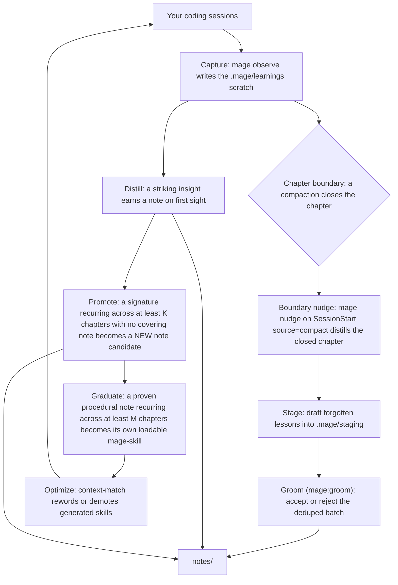

mage watches your coding sessions, drafts what looks worth remembering, and lets you confirm it into durable notes — without you stopping to write documentation. That cycle is the **self-grooming loop**. This page is the map; each stage links to its own page.

Two terms first, because everything below leans on them:

- A **note** is a small markdown file under `mage/notes/` holding one reusable lesson — insight plus procedure plus pointers, never a copy of a source. Notes are committed, indexed knowledge.
- A **compact-chapter** is one stretch of work between context compactions (or session ends). When your coding host compacts the conversation to free up context, that closes a chapter. mage counts chapters, not session ids — so one long, continuously-compacted chat still produces many chapters.

## The two paths

mage runs two complementary paths over the same captured signal. They share a capture stage and a human-confirm gate, but they catch different things.

**The lesson path (through the nudge).** Always-on inline capture and the boundary nudge draft short lessons the first time something is worth remembering. They land in a git-ignored staging area; you review the batch and accept the keepers into `notes/`. This is the everyday path — the one most new users will use. See [Stage and groom](./stage-groom.md).

**The recurrence path (the lower arc).** A deterministic engine folds the captured scratch into per-signature tallies. A pattern that keeps recurring — across enough distinct chapters, with no note already covering it — surfaces as a note candidate. A proven procedural note that recurs even more becomes its own auto-loadable skill. See [Promote and graduate](./promote-graduate.md).

Both paths converge on the same place: `notes/`, your committed knowledge, indexed in `INDEX.md`.

## Where each stage lives

| Stage | What it does | Page |
|---|---|---|
| Capture | Hook-fired `mage observe` appends session events to the git-ignored learnings scratch. | [Capture](./capture.md) |
| Boundary nudge | On a post-compaction start, `mage nudge` distills the closed chapter and drafts forgotten lessons. | [The boundary nudge](./nudge.md) |
| Stage and groom | The lesson path: staged drafts -> the `mage:groom` skill -> accepted notes. | [Stage and groom](./stage-groom.md) |
| Promote and graduate | The recurrence path: recurring signatures -> note candidates -> graduated skills. | [Promote and graduate](./promote-graduate.md) |
| Optimize | Context-match rewords or demotes the generated skills. | [Optimize](./optimize.md) |

## Nothing auto-commits

mage **writes files; you commit them.** Capture appends to a git-ignored scratch. Accepting a draft writes a note and re-indexes. Graduating mints a skill. None of these run `git commit` — every stage stops at the working tree and suggests a `git` command for you to run after you have reviewed the diff. The judgment calls — "is this a real lesson?", "is this trigger right?" — are always made by the host agent or by you, never by a model inside mage.

## What tunes the loop

Two numbers gate the recurrence path, and a sensitivity dial scales them together: **K** (how many chapters before a pattern becomes a note candidate) and **M** (how many before a proven note graduates into a skill). See [Thresholds and the dial](../reference/thresholds.mdx) for the exact values and the low / normal / high positions.
