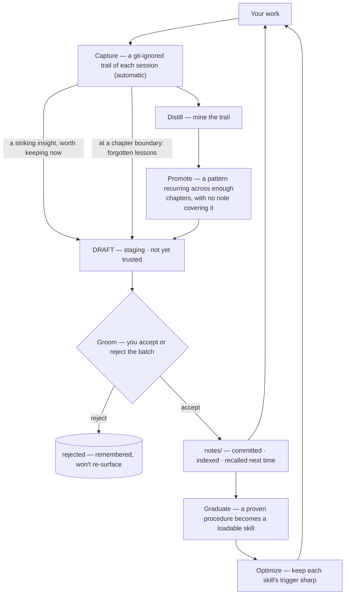
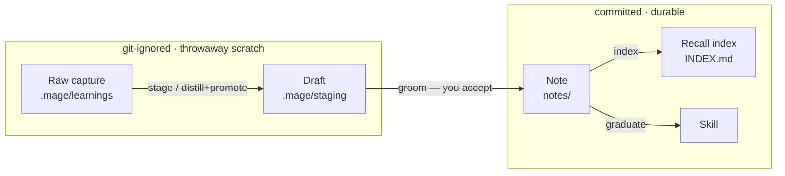
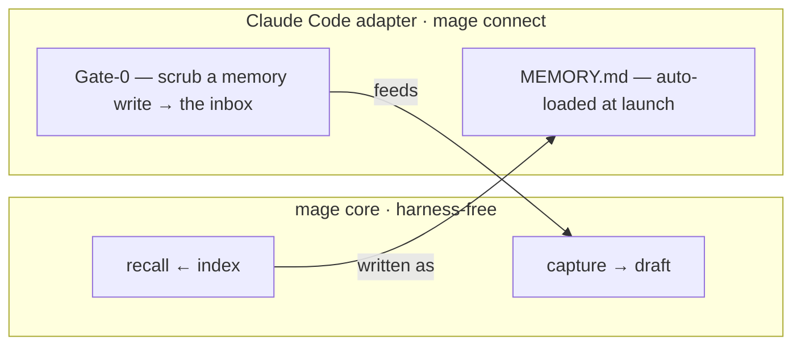

mage watches your coding sessions, drafts what looks worth remembering, and lets you confirm it into durable notes — without you stopping to write documentation. That cycle is the **self-grooming loop**. This page is the map; each stage links to its own page.

Two terms first, because everything below leans on them:

- A **note** is a small markdown file under `mage/notes/` holding one reusable lesson — insight plus procedure plus pointers, never a copy of a source. Notes are committed, indexed knowledge.
- A **compact-chapter** is one stretch of work between context compactions (or session ends). When your coding host compacts the conversation to free up context, that closes a chapter. mage counts chapters, not session ids — so one long, continuously-compacted chat still produces many chapters.

## The loop

mage is **harness-agnostic**: the diagram below is the whole of it, and nothing in it is specific to any one coding agent. (How a particular host plugs in — to make capture automatic and recall un-skippable — is an opt-in adapter, covered under [Using mage with a coding agent](#using-mage-with-a-coding-agent).)

A note is born one of two ways, and both converge on the same `groom → notes/` gate:

**The lesson path (first sight).** Always-on capture and the boundary nudge draft a short lesson the first time something is worth remembering — a striking insight kept on the spot, or a forgotten one the nudge surfaces when a chapter closes. This is the everyday path, and the one most new users will use. See [Stage and groom](./stage-groom.md) and [The boundary nudge](./nudge.md).

**The recurrence path.** A deterministic engine folds the captured trail into per-signature tallies. A pattern that keeps recurring — across enough distinct chapters, with no note already covering it — surfaces as a candidate. A proven procedural note that recurs even more **graduates** into its own auto-loadable skill, and **optimize** keeps that skill's trigger sharp. See [Promote and graduate](./promote-graduate.md).

Both paths converge on `notes/` — your committed knowledge, indexed in `INDEX.md` and recalled at the start of future work.

The chapter boundary is a **view**, not a stored state: mage derives it from the capture trail (a `PreCompact` marker, or a `SessionStart` with `source=compact`) rather than persisting a "chapter closed" flag. Nothing downstream waits on a record of the boundary; the digest is recomputed from the trail each time.

## The states a lesson moves through

A lesson is disposable until you accept it. It passes through two transient, git-ignored states before it becomes a committed one — and this table is the whole pipeline at a glance: where each state lives, whether git keeps it, and the one thing that moves it forward.

| State | Where it lives | Git | What moves it on |
|---|---|---|---|
| **Raw capture** | `.mage/learnings/` | ignored | written automatically by the capture hook; auto-pruned |
| **Draft** | `.mage/staging/` | ignored | `stage` (first sight) or `distill` → `promote` (recurrence); scrubbed + deduped |
| **Note** | `notes/` | **committed** | `groom` — you accept the draft; re-indexed on the way |
| **Recall index** | `INDEX.md` (and `MEMORY.md`) | **committed** | `index` regenerates it after every accept |
| **Skill** | a loadable skill | **committed** | `graduate` — a proven procedural note that recurs enough |

Only the bottom three rows are committed to git; the top two are throwaway scratch. And nothing here is durable until *you* run `git commit` — see [Nothing auto-commits](#nothing-auto-commits).

## Using mage with a coding agent

mage has **no runtime** — it rides whatever hooks the host gives it. Left to itself, the loop's capture is *volitional* (you write a note when you remember to) and recall is a file you're *meant* to read. A host **adapter**, wired by `mage connect`, makes both deterministic. For Claude Code it plugs into the loop at exactly two points — and nowhere inside it:

- **Capture.** Instead of Claude Code writing memories to its private store, mage co-opts that write, scrubs it before it touches disk, and drops it on the lesson path. See [Capture — the native-memory redirect](./capture.md).
- **Recall.** mage's index is written as `MEMORY.md` — the same content as the portable `INDEX.md`, under the filename Claude Code's auto-load looks for — so your notes are present at launch every session without anyone having to "read the index."

Strip the adapter away and the loop above is unchanged. On any other harness the same two seams are filled by the volitional directive — write a note to the inbox, read `INDEX.md` — same notes, same index, just without the un-skippable enforcement.

## Where each stage lives

| Stage | What it does | Page |
|---|---|---|
| Capture | A hook-fired trail of session events, written to a git-ignored scratch; never blocks your work. | [Capture](./capture.md) |
| Boundary nudge | On a post-compaction start, distills the closed chapter and drafts forgotten lessons. | [The boundary nudge](./nudge.md) |
| Stage and groom | The lesson path: staged drafts → the `mage:groom` skill → accepted notes. | [Stage and groom](./stage-groom.md) |
| Promote and graduate | The recurrence path: recurring signatures → note candidates → graduated skills. | [Promote and graduate](./promote-graduate.md) |
| Optimize | Context-match rewords or demotes the generated skills. | [Optimize](./optimize.md) |
| Claude Code adapter | The opt-in capture redirect + recall twin that make the loop deterministic on Claude Code. | [Capture](./capture.md) |

## Nothing auto-commits

mage **writes files; you commit them.** Capture appends to a git-ignored scratch. Accepting a draft writes a note and re-indexes. Graduating mints a skill. None of these run `git commit` — every stage stops at the working tree and suggests a `git` command for you to run after you have reviewed the diff. The judgment calls — "is this a real lesson?", "is this trigger right?" — are always made by the host agent or by you, never by a model inside mage.

## What tunes the loop

Two numbers gate the recurrence path, and a sensitivity dial scales them together: **K** (how many chapters before a pattern becomes a note candidate) and **M** (how many before a proven note graduates into a skill). See [Thresholds and the dial](../reference/thresholds.mdx) for the exact values and the low / normal / high positions.
